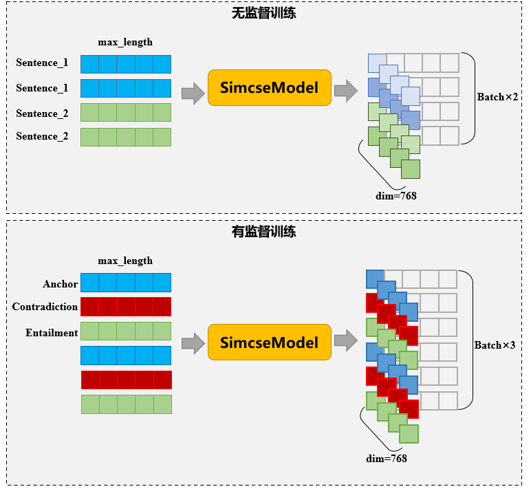
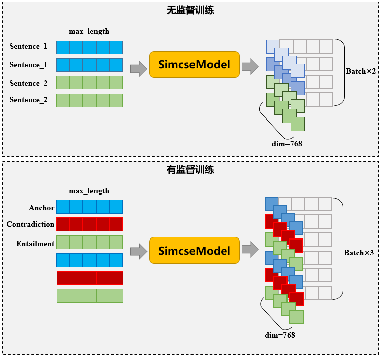

# 🧡💛💚ContrastiveLearning4Chinese🧡💛💚

🏆🏆用于中文句子表征的对比学习，模型为SimCSE🏆🏆

✅采用两种正负例构建方式： 
1）无监督。同一个句子在不同Dropout下的BERT表征为正例，不同句子的BERT表征为负例； 
2）有监督。基于文本蕴含数据集，相互蕴含的句子为正例，相互冲突的句子为负例。

✅代码结构简洁，可扩展和复用性强，包含大量中文注释

✅基于2023年最新的Pytorch和HugginFace Transformers框架实现

**第一张图：有监督和无监督条件下模型输入输出格式**

**第二张图：无监督训练方式对应的损失函数示意图**

**第三张图：有监督训练方式对应的损失函数示意图**

